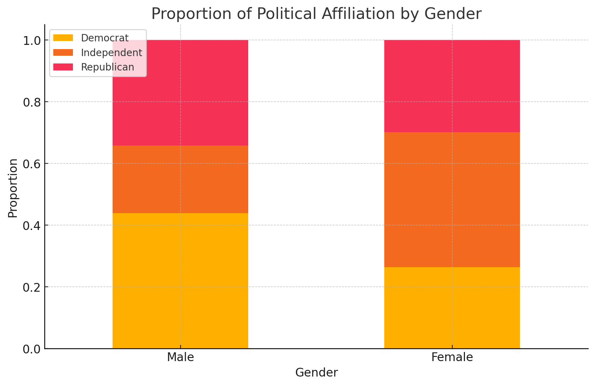

# Political Affiliation Prediction - README

## Project Overview

This project aims to predict the political affiliation of individuals based on survey data. The primary focus was on improving the model's performance by exploring various machine learning algorithms and feature engineering techniques. Initially, the data contained a significant amount of qualitative data, which required preprocessing before any modeling could be performed.

## Process Overview

### 1. Data Preprocessing

The original dataset contained a large amount of qualitative data, such as categorical variables. To make this data suitable for modeling, we needed to convert it into numerical format. This was achieved using the script `into_numerical.py`, which handled the transformation of categorical data into numerical features that could be used in machine learning models.

### 2. Gender-Based Data Separation

Upon initial analysis, we observed significant differences in the political affiliation distribution between genders. This prompted us to consider separating the data by gender and modeling them independently. However, during the modeling process, we found that this approach did not yield satisfactory results, likely due to the smaller sample size within each gender subgroup. Consequently, we reverted to processing and modeling the entire dataset as a whole.

### 3. Initial Model Trials

In the early stages of the project, we experimented with several machine learning algorithms, including:

- **Logistic Regression**
- **K-Nearest Neighbors (KNN)**
- **Convolutional Neural Networks (CNN)**
- **Decision Trees**
- **Random Forests**
- **Neural Networks (NN)**
- **Naive Bayes**

Through these trials, we determined that the Neural Network and Random Forest models performed the best. Although we also experimented with **Naive Bayes** and a **hard voting** ensemble method (combining predictions from multiple models), these approaches did not perform well. The hard voting method, in particular, struggled due to the three possible prediction outcomes, which resulted in suboptimal final predictions.

### 4. Feature Engineering and Hyperparameter Tuning

To maximize the performance of our models, we applied various feature engineering techniques and hyperparameter tuning strategies:

- **Neural Networks (NN)**:
  - We discovered that applying polynomial features and interaction terms, combined with cross-validation and dropout regularization, significantly improved the NN's performance. The optimal hyperparameters were found to be:
    - `batch_size=128`
    - `epochs=100`
    - `learning_rate=0.0001`
    - `dropout_rate=0.7`

- **Random Forest (RF)**:
  - For the Random Forest model, we found that feature selection using polynomial features and standardization, combined with cross-validation, yielded the best results. The optimal hyperparameters were:
    - `n_estimators=100`
    - `max_depth=10`
    - `min_samples_split=2`
    - `min_samples_leaf=1`
    - `max_features='log2'`

### 5. Exploring Model Combination

As our experiments progressed, we realized that achieving high predictive accuracy with a single model was challenging. This led us to explore whether different models exhibited varying accuracy rates across different political affiliations or genders:

- **Accuracy by Gender and Political Affiliation**:
  - We found that the Random Forest model had a more balanced accuracy across all political affiliations, while the Neural Network model showed high accuracy for predicting the two major parties but struggled with predicting the Independent party.
  - Despite this, we could not combine the posterior results of different political affiliations. Instead, we merged the accuracy rates across different genders, discovering that:
    - The Random Forest model had higher accuracy for females.
    - The Neural Network model maintained a more balanced accuracy across both genders.

### 6. Final Model Selection and Integration

After identifying the best-performing models and their optimal parameters, we finalized the model predictions by mapping them back to the test data based on the `id_num`. We then combined the results from both the NN and Random Forest models to generate the final dataset, which contains the predicted political affiliations for the test data.

### 7. Final Results

The final models used for prediction were:
- **Neural Network (NN)**: `CAH-201803-predictions-nn-bs128-ep100-lr0.0001-dr0.7`
- **Random Forest (RF)**: `CAH-201803-predictions-rf-n100-md10-ms2-ml1-mflog2`

These models were chosen for their superior performance during cross-validation, particularly in balancing accuracy across different genders and political affiliations.

## Project Files Overview

### 1. `CAH-201803-predictions-combined-gender.csv`
This file contains the final predictions after combining the results from the Neural Network and Random Forest models for both genders. The predictions are based on the best-performing models identified during the project.

### 2. `CAH-201803-predictions-nn-bs128-ep100-lr0.0001-dr0.7.csv`
This file contains the predictions made by the best-performing Neural Network model with the specified hyperparameters (`batch_size=128`, `epochs=100`, `learning_rate=0.0001`, `dropout_rate=0.7`).

### 3. `CAH-201803-predictions-rf-n100-md10-ms2-ml1-mflog2.csv`
This file contains the predictions made by the best-performing Random Forest model with the specified hyperparameters (`n_estimators=100`, `max_depth=10`, `min_samples_split=2`, `min_samples_leaf=1`, `max_features='log2'`).

### 4. `into_numerical.py`
This script is used to convert qualitative (categorical) data into numerical features suitable for machine learning models. It handles the encoding of categorical variables in the dataset.

### 5. `merge_2.py`
This script is used to merge the predictions from the Neural Network and Random Forest models into a single file. It takes the outputs from the individual model predictions and combines them into a final, comprehensive prediction file.

### 6. `nn_try_13.py`
This script contains the implementation of the Neural Network model, including the feature engineering, model training, and hyperparameter tuning processes.

### 7. `random_forest_try_4.py`
This script contains the implementation of the Random Forest model, including the feature selection, model training, and hyperparameter tuning processes.

### 8. `Codes for Other Models I tried.zip`
This zip file contains the code for other models we attempted during the project, including:

- **Naive Bayes**
- **Hard Voting Ensemble**
- **Logistic Regression**
- **K-Nearest Neighbors (KNN)**
- **Decision Trees**

These models were part of our initial trials but did not perform as well as the final selected models. The code in this zip file provides insight into our experimentation process and the methods we tested before arriving at the final models.

## Conclusion

The project culminated in a robust prediction model that effectively balances accuracy across different political affiliations and genders. The combination of Neural Networks and Random Forests, supported by extensive feature engineering and hyperparameter tuning, provided the best predictive performance.

